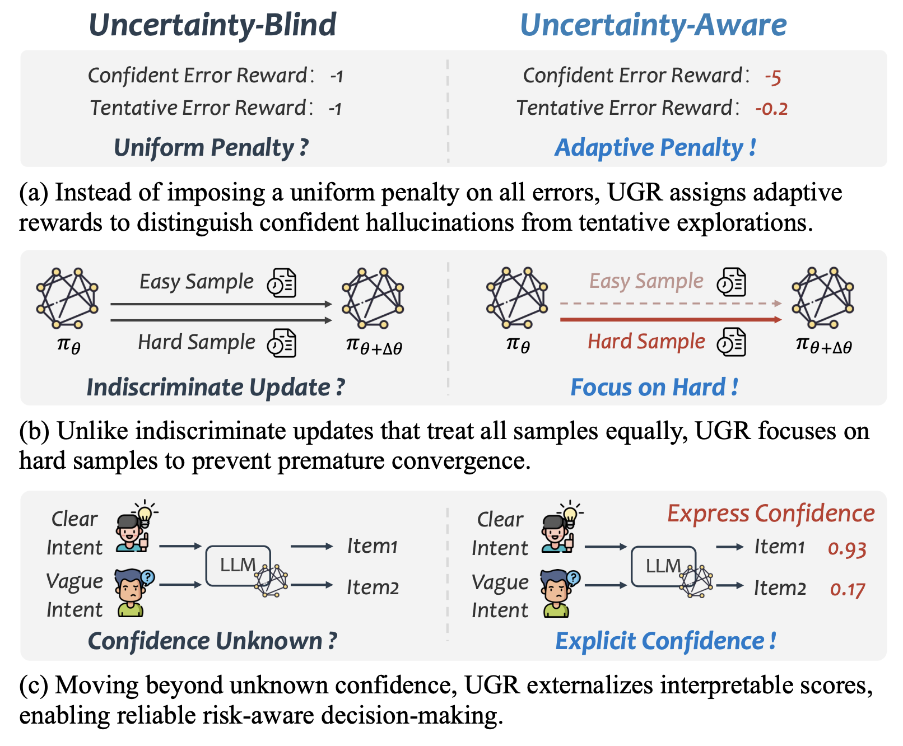
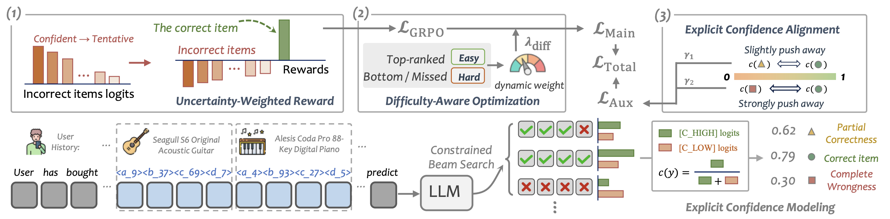

# UGR

This repository contains the PyTorch implementation for the paper **"Uncertainty-aware Generative Recommendation"**, accepted by **KDD 2026**.


## Overview

We identify a pervasive **uncertainty-blindness** issue in generative recommenders: they treat every prediction as equally reliable and ignore the predictive uncertainty behind each beam. This leads to two failures — during **training**, all target tokens are optimized uniformly regardless of how confident the model actually is; during **inference**, items are ranked purely by generation likelihood, leaving no signal that reflects how certain the model truly is about each predicted result.

<p align="left">
  
</p>

We address this by turning uncertainty itself into an explicit, learnable signal: UGR augments the vocabulary with confidence tokens and aligns the model via an uncertainty-aware reinforcement learning objective, so that the model can jointly generate a recommendation together with how confident it is in that prediction.



## Repository Structure

```
UGR/
├── data/
│   ├── _1/   # Raw data filtering & splitting
│   ├── _2/   # Text embedding generation
│   └── _3/   # RQ-VAE training & SID generation
├── train/
│   ├── SFT/  # Supervised fine-tuning
│   └── RL/   # Uncertainty-aware reinforcement learning
└── eval/     # Evaluation with confidence scoring
```

## Data Preparation

### 1. Download Raw Datasets
Download the raw datasets (e.g., Amazon18) from the [Amazon Datasets](https://nijianmo.github.io/amazon/index.html) repository.

### 2. Data Preprocessing
```bash
bash ./data/_1/amazon18_data_process.sh
```

### 3. Text Embedding Generation
```bash
bash ./data/_2/amazon_text2emb.sh
```

### 4. SID Generation
```bash
bash ./data/_3/rqvae.sh
python ./data/_3/generate_indices.py
```

## Training and Evaluation

### 1. Supervised Fine-Tuning (SFT)
```bash
bash ./train/SFT/run_train_SFT.sh
```

### 2. Uncertainty-aware RL
```bash
bash ./train/RL/run_train_RL.sh
```

### 3. Evaluation
```bash
bash ./eval/run_eval.sh
```

## Acknowledgements

Parts of our implementation build upon, or are inspired by, the following open-source projects. We sincerely thank their authors and the broader community for making their work publicly available:

- [LETTER](https://github.com/HonghuiBao2000/LETTER)
- [MiniOneRec](https://github.com/AkaliKong/MiniOneRec)

## Citation

If you find this repository useful, please consider giving it a star and citing our paper:

```bibtex
@article{fan2026uncertainty,
  title={Uncertainty-aware Generative Recommendation},
  author={Fan, Chenxiao and Gao, Chongming and Gong, Yaxin and Liu, Haoyan and Feng, Fuli and He, Xiangnan},
  journal={arXiv preprint arXiv:2602.11719},
  year={2026}
}
```

## Contact

For questions or issues, please open a GitHub issue or contact the first author.
